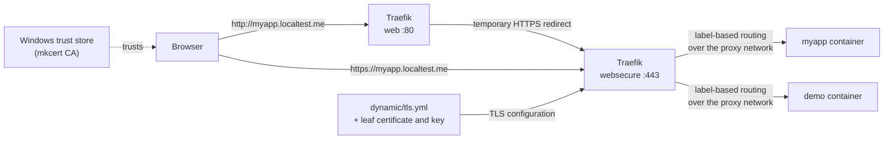
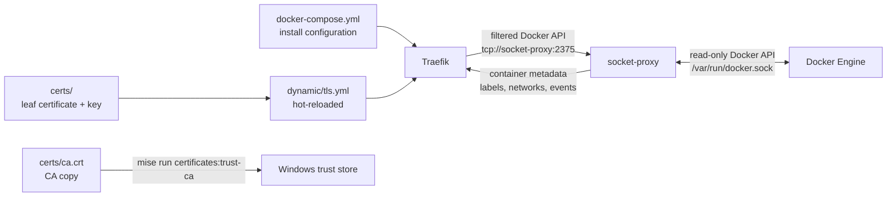
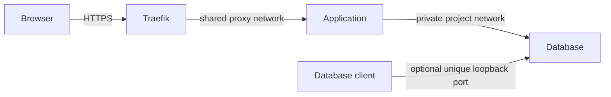

# traefik-local-proxy

Local HTTPS reverse proxy for Docker development. Traefik terminates TLS for
`*.localtest.me`, redirects HTTP to HTTPS, and routes containers via labels.
HTTPS-first means secure cookies, OAuth callbacks, and browser secure-context
APIs behave much closer to production - local CA and loopback DNS are realistic
but not identical to public production TLS.

Pairs with any local Docker project that benefits from clean HTTPS routing:
web apps, APIs, dashboards, documentation sites, admin tools, and internal
utilities.

## Contents

- [Quick start](#quick-start)
- [Troubleshooting](#troubleshooting)
- [How it works](#how-it-works)
- [What is localtest.me](#what-is-localtestme)
- [Certificate setup (WSL2 + Windows)](#certificate-setup-wsl2--windows)
- [Adding a service](#adding-a-service)
- [Connecting another Docker project](#connecting-another-docker-project)
- [Project database networking](#project-database-networking)
- [Available tasks](#available-tasks)
- [Configuration](#configuration)
- [TCP database routing (optional)](#tcp-database-routing-optional)
- [Install and dynamic config](#install-and-dynamic-config)
- [Backend TLS compatibility](#backend-tls-compatibility)
- [Optional hardening](#optional-hardening)
- [Security notes](#security-notes)
- [WSL2 notes](#wsl2-notes)

---

## Quick start

Prerequisites: Docker Engine with Compose v2 and `mise`. Windows PowerShell
must be accessible from WSL2 when using the Windows trust-store task.

`mise install` installs the repo-pinned versions of `mkcert` and `uv` defined in
`mise.toml`. The validation task runs a pinned version of `pre-commit` through
`uvx`; `uv` is otherwise only needed for that task.

Choose one startup mode:

| Mode | Task | Dashboard URL | Generates certs? | Touches Windows trust store? |
| --- | --- | --- | --- | --- |
| HTTPS (default, closest to production) | `mise run up` | <https://proxy.localtest.me> | Yes (`certificates:generate`) | Yes (`certificates:trust-ca`) |
| HTTP-only (no local CA required) | `mise run up-http` | <http://proxy.localtest.me> | No | No |

### HTTPS mode (default)

```bash
mise install                     # install pinned tools (mkcert, uv)
cp .env.example .env             # optional: override ports or log level
mise run certificates:generate   # generate the wildcard cert via mkcert (skips if present)
mise run certificates:trust-ca   # import the CA into Windows CurrentUser\Root (WSL2 -> Windows)
mise run up                      # start Traefik
mise run demo                    # start whoami test service -> https://demo.localtest.me
mise run demo-down               # remove the demo container after testing
```

Dashboard: <https://proxy.localtest.me>

Certificates are generated with [mkcert](https://github.com/FiloSottile/mkcert),
which is pinned in `mise.toml` and installed by `mise install`. mkcert keeps its
CA in its own CAROOT outside the repo; `mise run certificates:trust-ca` then imports the CA
certificate into the Windows trust store so Windows browsers trust the HTTPS
that Traefik serves from WSL2.

### HTTP-only mode

Installing a local root CA may not be allowed on a work-managed device. TLS is
optional: run `mise run up-http` without generating or trusting certificates.
Copying `.env.example` to `.env` is optional in both modes. HTTP mode does not
mount certificate files or load the dynamic TLS configuration, and serves the
dashboard at <http://proxy.localtest.me>.

HTTP-only mode is intended for local development where browser HTTPS behavior
is not required. Services used with it should route through the `web`
entrypoint and omit the `tls` label. The existing HTTPS setup remains the
default and is unchanged.

### Switching modes

The two modes use the same Compose project, container names, network, and host
ports. Running `mise run up-http` while HTTPS is running, or `mise run up` while
HTTP is running, causes Compose to recreate the proxy with the selected config;
you do not need to remove certificates or rebuild anything. The certificate
files and Windows trust entry remain on the machine but are unused in HTTP mode.
HTTPS mode uses temporary redirects so browsers do not retain a permanent
HTTP-to-HTTPS redirect after the proxy switches back to HTTP.

The proxy switches automatically, but routed application containers do not
change their labels. Use `mise run demo-http` for the HTTP demo, or update an
application's router from `websecure` plus `tls: "true"` to `web` without the
TLS label. Switch those labels back when returning to HTTPS.

---

## Troubleshooting

Quick hits for the most common issues. Each links to the section with full detail.

- **Browser says the certificate isn't trusted.** Run `mise run certificates:trust-ca`
  (see "Certificate setup").
- **`network proxy declared as external, but could not be found`.** Start
  `traefik-local-proxy` first - it creates the network (see "Adding a service").
- **Port `80`/`443` (or a database port) is already in use.** Override
  `TRAEFIK_HTTP_PORT`/`TRAEFIK_HTTPS_PORT`/`TRAEFIK_*_PORT` in `.env`, or skip
  that database's override file (see "Configuration").
- **A service returns a 404 or never gets a route.** Confirm the container is
  on the `proxy` network, has `traefik.enable=true`, and has either a
  `traefik.hostname` label or an enabled fallback (see "Adding a service").
- **Windows can't reach a WSL2-published port.** That's a WSL2 networking or
  Docker Engine port-publishing issue, not a certificate problem (see "WSL2
  notes").
- **Dashboard is unreachable.** Check `TRAEFIK_DASHBOARD_ENABLED` and confirm
  you're using the right scheme for the current mode (see "Switching modes").

---

## How it works

Two views: how a browser request reaches your container, and how Traefik
discovers containers and loads its configuration.

### Request flow



`*.localtest.me` resolves to `127.0.0.1`, so the browser reaches Traefik in
WSL2 with no `/etc/hosts` edits. HTTP is redirected to HTTPS; the certificate
and key are mounted as exact files and served via `dynamic/tls.yml`. The
certificate is trusted because the mkcert CA is in the Windows trust store.
HTTP-only mode skips the redirect and TLS; any existing certificate files and
Windows trust entry remain present but unused.

### Container discovery & configuration



Traefik watches Docker through the local socket-proxy service for containers that:

1. Are attached to the shared proxy network (default: `proxy`)
2. Have `traefik.enable=true`
3. Have routing labels or a `traefik.hostname` label

It automatically picks them up - no restart required.

---

## What is localtest.me

`localtest.me` is a public wildcard DNS domain operated by a third party. Its
commonly used IPv4 wildcard record, `*.localtest.me IN A 127.0.0.1`, resolves
subdomains to the IPv4 loopback address. It is a convenience domain, not an
IETF standard like `localhost`.

This stack publishes Docker ports on IPv4 `127.0.0.1` by default (see
`TRAEFIK_WEB_BIND_ADDRESS`/`TRAEFIK_TCP_BIND_ADDRESS` under "Configuration").
Some resolvers also return IPv6 `::1`; if a browser selects IPv6 first and the
request fails, use an IPv4-preferred resolver or configure Docker to publish
the ports on IPv6 too.

Why use it instead of `*.localhost`?

- Browsers special-case `localhost` but not all browser + OS combinations treat
  `myapp.localhost` as a secure context or as a valid same-site origin.
- `localtest.me` + a locally-trusted CA makes cookie, CORS, and secure-context
  behavior much closer to production.
- No `/etc/hosts` edits required.

See the DNS-privacy note in the Certificate setup section below.

---

## Certificate setup (WSL2 + Windows)

1. Generate the wildcard certificate (creates the mkcert CA on first run):

   ```bash
   ./scripts/generate-dev-certs.sh
   # Regenerate only the leaf while keeping the same CA:
   ./scripts/generate-dev-certs.sh --force
   ```

2. Import `certs/ca.crt` into the Windows trust store - **no admin required**:

   ```bash
   mise run certificates:trust-ca
   ```

   This invokes `scripts/trust-ca-windows.ps1`, which imports into
   `Cert:\CurrentUser\Root`. To remove it later: `mise run certificates:untrust-ca`.

> **Important:** `mise run certificates:untrust-ca` removes only the root certificate that
> matches `certs/ca.crt`. mkcert normally shares one CA across projects for a
> user profile, so other projects using that same CA will stop trusting it.

Because `--force` reuses the same mkcert CA, you do not need to re-run
`mise run certificates:trust-ca` after regenerating the leaf. If mkcert's CAROOT changes or
its CA is reset, the generator refuses to overwrite `certs/ca.crt`—even with
`--force`—because that file is required to identify the exact old trusted root.
Use the guarded rotation workflow instead:

```bash
mise run certificates:replace-ca
```

It removes the old CA from Windows `CurrentUser\Root`, verifies the removal,
replaces the staged CA and leaf, then trusts the new CA. The task manages only
that Windows store. If you separately installed the old CA in WSL, Firefox/NSS,
Java, or another trust store, remove it there before rotating it. If the old CA
cannot be removed, preserve `certs/ca.crt`; do not discard the only exact
identifier for the trusted root.

Then start Traefik and open <https://proxy.localtest.me>.

**Using a different certificate.** The proxy only ever reads whatever
`TRAEFIK_CERTIFICATE_FILE`/`TRAEFIK_CERTIFICATE_KEY_FILE` point at (see
"Configuration") - it does not care how the files got there. To bring your
own certificate (from internal PKI, another CA, etc.), just point those two
variables at your files in `.env`. To import a certificate/key pair out of a
container image instead - without ever starting that image - run:

```bash
mise run certificates:import-from-image -- IMAGE --cert-path PATH --key-path PATH
```

Run `mise run certificates:verify` after either path to check expiry, SAN
coverage, that the certificate and key actually match, chain structure, and
key file permissions.

> **Work / managed devices:** Installing a custom root CA may be against your
> IT policy and can trigger endpoint security tooling. Confirm it is allowed
> before trusting `ca.crt` on a corporate machine.
>
> **DNS privacy:** `localtest.me` subdomains are resolved publicly (to
> `127.0.0.1`). Do not use confidential project names, client names, or
> employer names as subdomains on a work network. Use generic names like
> `api.localtest.me`, `demo.localtest.me`, `app.localtest.me`.
>
> **Team setup (onboarding):** Every developer runs `mise run certificates:generate`, which uses
> mkcert to create their **own** local CA (stored in their own mkcert CAROOT) and
> sign their own leaf. Never share that CA around for the whole team to trust:
> whoever holds a CA private key that other machines trust can mint trusted
> certificates for *any* website on every machine that imported it. mkcert keeps
> the CA key in CAROOT, outside the repo, and `certs/` is gitignored (with the
> pre-commit / CI gitleaks hooks as a backstop), so the CA private key never
> leaves the machine that created it. When you re-image or hand off a machine,
> run `mise run certificates:untrust-ca` first.

---

## Adding a service

In your service's `docker-compose.yml`:

```yaml
services:
  myapp:
    image: myapp:latest
    networks:
      - proxy
    labels:
      traefik.enable: "true"
      traefik.hostname: "myapp"   # routes https://myapp.localtest.me
      traefik.http.routers.myapp.entrypoints: "websecure"
      traefik.http.routers.myapp.tls: "true"
      # Required if no backend port can be inferred or several are exposed.
      # Keeping it explicit also makes examples portable:
      traefik.http.services.myapp.loadbalancer.server.port: "8000"

networks:
  proxy:
    external: true
    name: proxy
```

> **Hostname with the default rule:** if you define an explicit router `rule`,
> `traefik.hostname` is optional and none of the below applies. Otherwise, the
> default rule resolves a service's `*.localtest.me` hostname in this order:
>
> 1. the `traefik.hostname` label, if present (always checked first, used
>    exactly as written)
> 2. the Compose service name, only if `TRAEFIK_FALLBACK_TO_COMPOSE_SERVICE_NAME=true`
>    (normalized - e.g. underscores become hyphens)
> 3. the container name, only if `TRAEFIK_FALLBACK_TO_CONTAINER_NAME=true`
>    (also normalized)
> 4. otherwise, no route is generated for that container at all
>
> Both fallback tiers default to `false` - by default you still need
> `traefik.hostname`, same as before. See "Configuration" for both variables.

**Start traefik-local-proxy first** - it creates the `proxy` network. Other
services reference it as external and will fail to start if the network does
not exist. If you run `mise run down` while no other containers are attached,
start Traefik again before starting those services.

---

## Connecting another Docker project

In another project's `docker-compose.yml`:

```yaml
services:
  myapp:
    image: myapp:latest
    networks:
      - default
      - proxy
    labels:
      traefik.enable: "true"
      traefik.hostname: "myapp"
      traefik.http.routers.myapp.entrypoints: "websecure"
      traefik.http.routers.myapp.tls: "true"
      traefik.http.services.myapp.loadbalancer.server.port: "3000"

networks:
  proxy:
    external: true
    name: proxy
```

Start `traefik-local-proxy` first, then start the other project. The service
will be reachable at <https://myapp.localtest.me>.

> **Required network name:** The shared Traefik network must be named `proxy`
> by default. Every consuming Compose project must join an external network
> with `name: proxy`. This can be overridden via the advanced
> `TRAEFIK_NETWORK_NAME` setting (see "Configuration"), but only if every
> already-configured consuming project's own network name changes to match -
> otherwise discovery breaks silently for all of them.

---

## Project database networking

This proxy is intended to remain running as shared local infrastructure. Both
proxy services use `restart: unless-stopped`, so Docker restarts them after a
Docker Engine or machine restart unless you explicitly stopped them. Start the
proxy once with `mise run up` (or `mise run up-http` for HTTP-only), use
`mise run update` (or `mise run update-http`) to apply image or configuration
updates, and avoid `mise run down` during normal use because it also tries to
remove the shared network.

For a project with an application and a database, attach the application to
both its private project network and the shared `proxy` network. Keep the
database only on the private project network:

```yaml
services:
  myapp:
    image: myapp:latest
    networks:
      - default
      - proxy
    labels:
      traefik.enable: "true"
      traefik.hostname: "project-a"
      traefik.http.routers.project-a.entrypoints: "websecure"
      traefik.http.routers.project-a.tls: "true"
      traefik.http.services.project-a.loadbalancer.server.port: "3000"

  postgres:
    image: postgres:17
    environment:
      POSTGRES_PASSWORD: example
    networks:
      - default
    # Optional access for a host client such as DBeaver:
    ports:
      - "127.0.0.1:15432:5432"

networks:
  proxy:
    external: true
    name: proxy
```

The application connects directly to `postgres:5432` using Docker's internal
DNS; it does not send its database traffic through Traefik. A browser reaches
the application through Traefik at <https://project-a.localtest.me>. If
DBeaver, SSMS, or another host application needs database access, publish a
unique loopback port from that project's database container, such as
`127.0.0.1:15432` above. Use a different host port for each project.

The same direct-networking pattern applies to every supported database. If the
Compose service uses the conventional name, the application connects to:

- Postgres: `postgres:5432`
- MSSQL: `mssql:1433`
- MySQL: `mysql:3306`
- Neo4j: `neo4j:7687`



The shared TCP entrypoints described below are an opt-in alternative for a
single database service per entrypoint. Rules such as ``HostSNI(`*`)`` match
all connections and cannot distinguish several Postgres, MSSQL, MySQL, or
Neo4j services on the same port. They are therefore not the recommended
database path when multiple projects use the same database protocol.

---

## Available tasks

Run `mise install` once to install repo-managed tools (mkcert, uv), then use any task
below. `mise run validate` is fully self-contained - no system-level
`pre-commit` or `shellcheck` install required.

```text
mise run up          # start Traefik + create proxy network
mise run up-http     # start Traefik without local TLS certificates
mise run up-without-http-to-https-redirect  # advanced: HTTPS mode, redirect disabled
mise run stop        # stop Traefik, keep proxy network
mise run down        # stop Traefik and remove proxy if no other containers use it
mise run restart     # restart Traefik process; use up to apply config changes
mise run logs        # follow Traefik logs
mise run ps          # show service status
mise run update      # pull images + apply the HTTPS configuration
mise run update-http # pull images + apply the HTTP-only configuration
mise run certificates:generate            # generate the wildcard cert via mkcert (skips if already present)
mise run certificates:verify              # verify the configured cert/key: expiry, SAN, pairing, chain, permissions
mise run certificates:import-from-image   # import a cert/key pair from a container image without starting it
mise run certificates:replace-ca          # untrust old Windows CA, replace it, and trust the new CA
mise run certificates:trust-ca            # import CA into Windows CurrentUser trust store (WSL2 → Windows)
mise run certificates:untrust-ca          # remove dev CA from Windows CurrentUser trust store
mise run demo        # start whoami test service at https://demo.localtest.me
mise run demo-http   # start whoami test service at http://demo.localtest.me
mise run demo-down   # stop the whoami test service
mise run config      # validate docker-compose.yml
mise run validate    # run pre-commit hooks + validate all compose configs
mise run smoke       # live HTTPS/HTTP transition and custom-port checks
mise run smoke-fallback # live hostname-fallback resolution-order checks
mise run network     # list containers currently on proxy
```

The smoke task uses loopback ports `18080`/`18443`, a disposable network, and
cleans up afterward. It refuses to run while the normal proxy or demo
containers exist.

---

## Configuration

| Variable | Default | Description |
| --- | --- | --- |
| `TRAEFIK_WEB_BIND_ADDRESS` | `127.0.0.1` | Bind address for the HTTP/HTTPS ports. Widening this does not by itself make the proxy reachable from a remote device - see the exposure notes below |
| `TRAEFIK_TCP_BIND_ADDRESS` | `127.0.0.1` | Bind address for database TCP entrypoints (see "TCP database routing"). Independent from `TRAEFIK_WEB_BIND_ADDRESS` on purpose |
| `TRAEFIK_HTTP_PORT` | `80` | Host HTTP port (redirects to HTTPS in HTTPS mode) |
| `TRAEFIK_HTTPS_PORT` | `443` | Host HTTPS port (included in redirects) |
| `TRAEFIK_NETWORK_NAME` | `proxy` | **Advanced.** Docker network shared with routed projects. Changing it requires every already-configured consuming project to change too, or discovery breaks silently |
| `TRAEFIK_DASHBOARD_ENABLED` | `true` | Set to `false` to fully disable the dashboard/API router |
| `TRAEFIK_FALLBACK_TO_COMPOSE_SERVICE_NAME` | `false` | Route `<compose-service-name>.localtest.me` when `traefik.hostname` is absent (see "Adding a service") |
| `TRAEFIK_FALLBACK_TO_CONTAINER_NAME` | `false` | Route `<container-name>.localtest.me` when `traefik.hostname` is absent and the service-name tier above didn't match |
| `TRAEFIK_CERTIFICATE_FILE` | `./certs/localtest.me.crt` | Certificate file the proxy mounts - point this at any cert, however it got there |
| `TRAEFIK_CERTIFICATE_KEY_FILE` | `./certs/localtest.me.key` | Matching private key file |
| `TRAEFIK_NEO4J_PORT` | `7687` | Neo4j TCP entrypoint |
| `TRAEFIK_MSSQL_PORT` | `1433` | MSSQL TCP entrypoint |
| `TRAEFIK_MYSQL_PORT` | `3306` | MySQL TCP entrypoint |
| `TRAEFIK_POSTGRES_PORT` | `5432` | Postgres TCP entrypoint |
| `TRAEFIK_LOG_LEVEL` | `INFO` | Log verbosity: DEBUG, INFO, WARN, ERROR |

Override these settings in an optional `.env`. With non-default web ports, use
the explicit port in browser URLs—for example, `http://demo.localtest.me:8080`
and `https://demo.localtest.me:8443`. HTTPS mode constructs its redirect using
the published `TRAEFIK_HTTPS_PORT`.

The Traefik image version is a literal tag in the Compose manifests (not a
variable), which keeps it the authoritative source that Dependabot updates
automatically. To run a different image instead, add
`docker-compose.use-custom-traefik-image.yml` to your `-f` list and set
`TRAEFIK_IMAGE`; see that file for the exact invocation. This is an advanced,
opt-in path - the default Quick Start always uses the pinned, tested image.

The automatic HTTP-to-HTTPS redirect has no on/off env var - Traefik has no
boolean flag for it, the mere presence of the redirect flags is what enables
it, and Compose's `command:` key fully replaces (not merges) across `-f`
files, so there is no way to toggle just those flags with a variable. To
disable it, use `mise run up-without-http-to-https-redirect`, or add
`docker-compose.disable-http-to-https-redirect.yml` to your `-f` list
directly. A CI check keeps that file in sync with docker-compose.yml's
command list.

The TCP database ports are not published by default because they conflict
with local installs of Neo4j, MSSQL, MySQL, and Postgres - each is only
published by adding its own `docker-compose.<db>.yml` override file (see
"TCP database routing"). Leave the relevant override file out if that port is
already in use on the host.

**Exposure notes:**

- Widening `TRAEFIK_WEB_BIND_ADDRESS` beyond `127.0.0.1` still requires a
  remote DNS/hosts override pointing at this machine, CA trust on the remote
  client, and host firewall access - `*.localtest.me` resolves every client
  to its own loopback address, not to this machine, so binding wider does not
  by itself make anything reachable remotely.
- Widening `TRAEFIK_TCP_BIND_ADDRESS` exposes every currently-enabled
  database override port (see "TCP database routing") to host interfaces,
  not just one.
- Disable or otherwise protect the dashboard (`TRAEFIK_DASHBOARD_ENABLED=false`)
  before widening `TRAEFIK_WEB_BIND_ADDRESS`.
- `mise run up` and `mise run validate` print a non-blocking advisory warning
  when either bind address resolves to something other than `127.0.0.1`. This
  only runs on mise-managed tasks - it cannot protect a raw `docker compose up`
  invocation.

---

## TCP database routing (optional)

The HTTPS Compose command always defines TCP entrypoints for Neo4j (7687),
MSSQL (1433), MySQL (3306), and Postgres (5432), but **none of their host
ports are published unless you add the matching override file** to your `-f`
list: `docker-compose.neo4j.yml`, `docker-compose.mssql.yml`,
`docker-compose.mysql.yml`, `docker-compose.postgres.yml`. There is nothing
to uncomment in `docker-compose.yml` - add only the override files you need:

```bash
docker compose -f docker-compose.yml -f docker-compose.postgres.yml up -d
```

Publishing a port only opens the entrypoint - it does not route anything by
itself. An actual database container still needs its own TCP router/service
labels, for example:

```yaml
services:
  postgres:
    networks:
      - proxy
    labels:
      traefik.enable: "true"
      traefik.tcp.routers.postgres.entrypoints: "postgres"
      traefik.tcp.routers.postgres.rule: "HostSNI(`*`)"
      traefik.tcp.services.postgres.loadbalancer.server.port: "5432"

networks:
  proxy:
    external: true
    name: proxy
```

Connect the client to `${TRAEFIK_TCP_BIND_ADDRESS:-127.0.0.1}:${TRAEFIK_POSTGRES_PORT:-5432}`.
Repeat the pattern with the matching entrypoint and container port for the
other database types. Those ports commonly conflict with local database
installs; for the normal multi-project setup, use private project networking
and optional per-project loopback bindings as described above instead.

**Read this before assuming any database can share an entrypoint by
hostname.** A raw, non-TLS `HostSNI(\`*\`)` rule like the one above supports
exactly **one backend per entrypoint** - it cannot distinguish between
several Postgres (or several MSSQL, MySQL, or Neo4j) containers on the same
port. Traefik does support routing by SNI after a client's TLS/STARTTLS
negotiation for some protocols - it explicitly documents this for Postgres,
provided the client uses a compatible `sslmode` - but this is
protocol-and-client-specific behavior, not a general Traefik capability.
**Do not assume it generalizes to MSSQL, MySQL, or Neo4j** without testing
that protocol's own TLS/negotiation handshake; each override file's own
header comment repeats this caveat. See [Traefik's TCP TLS routing
documentation](https://doc.traefik.io/traefik/reference/routing-configuration/tcp/tls/)
for the mechanism this depends on. Beyond that, this is raw TCP forwarding:
authentication and encryption remain entirely the responsibility of the
database protocol and client.

---

## Install and dynamic config

Traefik install configuration lives in each Compose service's `command` list:
[`docker-compose.yml`](./docker-compose.yml) for HTTPS and
[`docker-compose.http.yml`](./docker-compose.http.yml) for HTTP-only mode.
Traefik supports file, CLI, and environment install configuration as separate
methods, so this repository uses CLI consistently rather than mixing methods.
That lets Compose interpolate the selected network, log level, and external
HTTPS redirect port. HTTP-only mode has no `websecure` entrypoint, HTTPS port,
file provider, or certificate mount.

Dynamic TLS configuration lives in
[`dynamic/tls.yml`](./dynamic/tls.yml).

The HTTPS Compose file mounts `dynamic/` read-only and mounts only the files
referenced by `TRAEFIK_CERTIFICATE_FILE`/`TRAEFIK_CERTIFICATE_KEY_FILE`
(default `certs/localtest.me.crt`/`certs/localtest.me.key`) at their exact
container paths. Traefik does not receive `certs/ca.crt` or any unrelated
file that may exist in `certs/`. The checked-in `tls.yml` expects those exact
leaf filenames regardless of which host files back them. HTTP-only mode does
not mount or load the dynamic directory or certificate files.

Key install settings in the Compose commands:

- `providers.docker.defaultRule` generates routes from `traefik.hostname`
  labels without explicit `Host()` rules in every label set.
- `docker-compose.yml` sets the Docker provider endpoint and the shared
  network (`proxy` by default, `TRAEFIK_NETWORK_NAME`) with CLI flags. It
  also sets the redirect target to the externally published HTTPS port.
- `providers.file` watches `dynamic/` for hot-reload. HTTPS mode watches the
  whole directory (TLS config plus the backend-TLS-compatibility transport
  below); HTTP-only mode loads only the single transport file, since it has
  no TLS config to hot-reload.
- `entrypoints.web` redirects HTTP to HTTPS temporarily in HTTPS mode.
- `api.insecure=false` - the dashboard is exposed only through a labeled
  router: TLS in the default mode and loopback-only HTTP in HTTP mode.

---

## Backend TLS compatibility

Some backend services present a self-signed or otherwise untrusted HTTPS
certificate. Rather than a global bypass, this repo ships one named,
inert-by-default `serversTransport` in
[`dynamic/serverstransport.yml`](./dynamic/serverstransport.yml):

```yaml
http:
  serversTransports:
    skip-backend-certificate-verification:
      insecureSkipVerify: true
```

`insecureSkipVerify: true` weakens certificate verification **between
Traefik and that one backend** - it does nothing on its own, and is safer
than a global bypass only because each service must opt in individually, not
because it's free. A service opts in with **both** of these labels:

```yaml
traefik.http.services.example.loadbalancer.server.scheme: "https"
traefik.http.services.example.loadbalancer.serverstransport: "skip-backend-certificate-verification@file"
```

`server.scheme: "https"` is required alongside the transport reference -
without it, Traefik's port-based scheme inference may never attempt HTTPS to
the backend at all, making the transport reference alone insufficient.

This works in both proxy modes. In HTTPS mode the whole `dynamic/` directory
is mounted and watched, same as the TLS config. In HTTP-only mode, only
`dynamic/serverstransport.yml` itself is mounted and loaded via
`--providers.file.filename` (not `--providers.file.directory` - HTTP-only
mode has no TLS store to configure, so `dynamic/tls.yml` is never loaded
there).

A healthy `--ping` healthcheck only proves Traefik itself is running - it
does not prove this file parsed or the named transport actually registered.

---

## Optional hardening

### Dashboard basic auth

Add a `dynamic/dashboard-auth.yml` file (gitignore it if it contains
credentials):

```yaml
http:
  middlewares:
    dashboard-auth:
      basicAuth:
        users:
          - "admin:$apr1$..."  # htpasswd -nb admin <password>
```

Then reference the middleware on the dashboard router label in
`docker-compose.yml`:

```yaml
traefik.http.routers.proxy.middlewares: "dashboard-auth@file"
```

Since ports are loopback-only, this is defense-in-depth, not a hard
requirement.

### Security response headers

Add `dynamic/security-headers.yml` and reference it as a middleware on any
router:

```yaml
http:
  middlewares:
    security-headers:
      headers:
        frameDeny: true
        contentTypeNosniff: true
        browserXssFilter: true
        referrerPolicy: "strict-origin-when-cross-origin"
        # HSTS intentionally disabled - do not enable on a dev domain.
        # Preloaded HSTS persists in browsers after you decommission the proxy.
        # forceSTSHeader: true
        # stsSeconds: 31536000
```

---

## Security notes

- All ports are bound to `127.0.0.1` only by default - not exposed on the LAN
  unless you deliberately widen `TRAEFIK_WEB_BIND_ADDRESS`/`TRAEFIK_TCP_BIND_ADDRESS`
  (see "Configuration"). Disable or protect the dashboard first if you do.
- The dashboard is served over HTTPS through the `proxy.localtest.me` route in
  the default mode. The explicit HTTP fallback serves it over loopback HTTP.
  `api.insecure` remains disabled in both modes.
- Docker socket access effectively grants full Docker API access on the host.
  The raw socket is mounted only into `socket-proxy`; Traefik talks to the
  filtered API endpoint at `tcp://socket-proxy:2375`. Keep this stack
  local-only.
- The leaf private key in `certs/` is mode `600` and gitignored; the CA private
  key is not in the repo at all - mkcert keeps it in its CAROOT. That CA key is
  powerful: if it leaks and is trusted on any machine, an attacker can mint
  trusted certificates for that CA scope. Treat it as a secret.
- Do not use client, project, or employer names as `localtest.me` subdomains
  on a work network. Use generic names (e.g. `demo`, `api`, `app`).
- Backend HTTPS certificate verification is never bypassed globally. The
  named `skip-backend-certificate-verification` transport (see "Backend TLS
  compatibility") is inert until a specific service opts in via its own
  labels.

---

## WSL2 notes

- Docker Engine runs on the WSL2 instance - `mise run up` runs there too.
- `*.localtest.me` resolves publicly to `127.0.0.1`, so Windows browsers reach
  WSL2-published ports without `/etc/hosts` changes.
- The optional database port bindings are disabled by default. If an enabled
  port conflicts with a local database, disable that binding again or assign a
  different `TRAEFIK_*_PORT` value in `.env`.
- Certificate trust is determined by the Windows trust store, not the WSL2
  trust store. Use `mise run certificates:trust-ca` to import `certs/ca.crt` into Windows
  `CurrentUser\Root` (no admin required). To remove it: `mise run certificates:untrust-ca`.
  If Windows cannot reach WSL2-published ports, that is a WSL2 networking or
  Docker Engine port-publishing issue, not a certificate issue.
