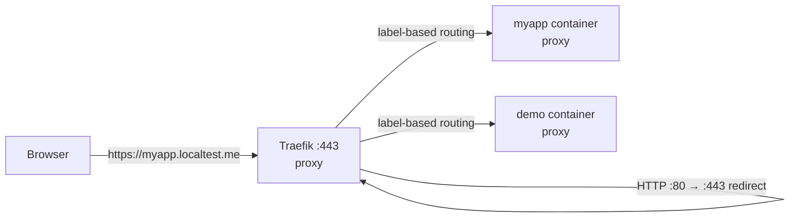

# traefik-local-proxy

Local HTTPS reverse proxy for Docker development. Traefik terminates TLS for
`*.localtest.me`, redirects HTTP to HTTPS, and routes containers via labels.
HTTPS-first means secure cookies, OAuth callbacks, and browser secure-context
APIs behave much closer to production - local CA and loopback DNS are realistic
but not identical to public production TLS.

Pairs with any local Docker project that benefits from clean HTTPS routing:
web apps, APIs, dashboards, documentation sites, admin tools, and internal
utilities.

---

## Quick start

Prerequisites: Docker Engine with Compose and `mise`. Choose one startup mode.
The HTTPS mode is the default and is closest to production; the HTTP mode does
not generate certificates or modify the Windows trust store.

### HTTPS mode (default)

```bash
mise install            # install pinned tools (mkcert, uv)
cp .env.example .env    # review ports and Traefik version
mise run certs          # generate the wildcard cert via mkcert (skips if present)
mise run trust-ca       # import the CA into Windows CurrentUser\Root (WSL2 -> Windows)
mise run up             # start Traefik
mise run demo           # start whoami test service -> https://demo.localtest.me
mise run demo-down      # remove the demo container after testing
```

Dashboard: <https://proxy.localtest.me>

Certificates are generated with [mkcert](https://github.com/FiloSottile/mkcert),
which is pinned in `mise.toml` and installed by `mise install`. mkcert keeps its
CA in its own CAROOT outside the repo; `mise run trust-ca` then imports the CA
certificate into the Windows trust store so Windows browsers trust the HTTPS
that Traefik serves from WSL2.

### HTTP-only mode

Installing a local root CA may not be allowed on a work-managed device. TLS is
optional: after `mise install` and copying `.env`, run `mise run up-http`. Do
not run `mise run certs` or `mise run trust-ca`. This mode does not mount
`certs/` or load the dynamic TLS configuration, and serves the dashboard at
<http://proxy.localtest.me>.

HTTP-only mode is intended for local development where browser HTTPS behavior
is not required. Services used with it should route through the `web`
entrypoint and omit the `tls` label. The existing HTTPS setup remains the
default and is unchanged.

### Switching modes

The two modes use the same Compose project, container names, network, and host
ports. Running `mise run up-http` while HTTPS is running, or `mise run up` while
HTTP is running, causes Compose to recreate the proxy with the selected config;
you do not need to remove certificates or rebuild anything. The certificate
files and Windows trust entry remain on the machine but are unused in HTTP mode.

The proxy switches automatically, but routed application containers do not
change their labels. Use `mise run demo-http` for the HTTP demo, or update an
application's router from `websecure` plus `tls: "true"` to `web` without the
TLS label. Switch those labels back when returning to HTTPS.

---

## How it works



Traefik watches Docker through the local socket-proxy service for containers that:

1. Are attached to the shared proxy network (default: `proxy`)
2. Have `traefik.enable=true`
3. Have routing labels or a `traefik.hostname` label

It automatically picks them up - no restart required.

---

## What is localtest.me

`localtest.me` is a public wildcard DNS domain that resolves every subdomain to
`127.0.0.1`. It is not an IETF standard like `localhost` - it is a convenience
domain run by a third party. It works because the record is public:
`*.localtest.me IN A 127.0.0.1`.

Why use it instead of `*.localhost`?

- Browsers special-case `localhost` but not all browser + OS combinations treat
  `myapp.localhost` as a secure context or as a valid same-site origin.
- `localtest.me` + a locally-trusted CA makes cookie, CORS, and secure-context
  behavior much closer to production.
- No `/etc/hosts` edits required.

See the DNS-privacy note in the Certificate setup section below.

---

## Certificate setup (WSL2 + Windows)

1. Generate the wildcard certificate (creates the mkcert CA on first run):

   ```bash
   ./scripts/generate-dev-certs.sh
   # Use --force to regenerate the leaf (reuses the existing mkcert CA)
   ```

2. Import `certs/ca.crt` into the Windows trust store - **no admin required**:

   ```bash
   mise run trust-ca
   ```

   This invokes `scripts/trust-ca-windows.ps1`, which imports into
   `Cert:\CurrentUser\Root`. To remove it later: `mise run untrust-ca`.

    mkcert sets a browser-compatible validity on the leaf and a long-lived CA.
    Because `--force` normally reuses the same mkcert CA, you do not need to
    re-run `mise run trust-ca` after regenerating the leaf. If mkcert's CA was
    changed or reset, import the new CA again after regeneration.

3. Start Traefik and open <https://proxy.localtest.me>.

> **Work / managed devices:** Installing a custom root CA may be against your
> IT policy and can trigger endpoint security tooling. Confirm it is allowed
> before trusting `ca.crt` on a corporate machine.
>
> **DNS privacy:** `localtest.me` subdomains are resolved publicly (to
> `127.0.0.1`). Do not use confidential project names, client names, or
> employer names as subdomains on a work network. Use generic names like
> `api.localtest.me`, `demo.localtest.me`, `app.localtest.me`.
>
> **Team setup (onboarding):** Every developer runs `mise run certs`, which uses
> mkcert to create their **own** local CA (stored in their own mkcert CAROOT) and
> sign their own leaf. Never share that CA around for the whole team to trust:
> whoever holds a CA private key that other machines trust can mint trusted
> certificates for *any* website on every machine that imported it. mkcert keeps
> the CA key in CAROOT, outside the repo, and `certs/` is gitignored (with the
> pre-commit / CI gitleaks hooks as a backstop), so the CA private key never
> leaves the machine that created it. When you re-image or hand off a machine,
> run `mise run untrust-ca` first.

---

## Adding a service

In your service's `docker-compose.yml`:

```yaml
services:
  myapp:
    image: myapp:latest
    networks:
      - proxy
    labels:
      traefik.enable: "true"
      traefik.hostname: "myapp"   # routes https://myapp.localtest.me
      traefik.http.routers.myapp.entrypoints: "websecure"
      traefik.http.routers.myapp.tls: "true"
      # Only needed if the container exposes multiple ports:
      traefik.http.services.myapp.loadbalancer.server.port: "8000"

networks:
  proxy:
    external: true
    name: ${TRAEFIK_PROXY_NETWORK:-proxy}
```

> **Hostname with the default rule:** if you rely on the default rule, set
> `traefik.hostname`. Without it, Traefik cannot generate the expected
> `*.localtest.me` host rule. If you define an explicit router `rule`,
> `traefik.hostname` is optional.

**Start traefik-local-proxy first** - it creates the `proxy` network. Other
services reference it as external and will fail to start if the network does
not exist. If you run `mise run down` while no other containers are attached,
start Traefik again before starting those services.

---

## Connecting another Docker project

In another project's `docker-compose.yml`:

```yaml
services:
  myapp:
    image: myapp:latest
    networks:
      - default
      - proxy
    labels:
      traefik.enable: "true"
      traefik.hostname: "myapp"
      traefik.http.routers.myapp.entrypoints: "websecure"
      traefik.http.routers.myapp.tls: "true"
      traefik.http.services.myapp.loadbalancer.server.port: "3000"

networks:
  proxy:
    external: true
    name: ${TRAEFIK_PROXY_NETWORK:-proxy}
```

Start `traefik-local-proxy` first, then start the other project. The service
will be reachable at <https://myapp.localtest.me>.

> **Custom network name:** If you set `TRAEFIK_PROXY_NETWORK` to something other
> than `proxy`, set the same value in each consuming project's `.env`, or replace
> the variable reference with the concrete network name. If the names diverge,
> Traefik discovers containers but routes traffic through the wrong network and
> nothing loads.

---

## Available tasks

Run `mise install` once to install repo-managed tools (mkcert, uv), then use any task
below. `mise run validate` is fully self-contained - no system-level
`pre-commit` or `shellcheck` install required.

```text
mise run up         # start Traefik + create proxy network
mise run up-http    # start Traefik without local TLS certificates
mise run stop       # stop Traefik, keep proxy network
mise run down       # stop Traefik and remove proxy if no other containers use it
mise run restart    # restart Traefik process; use up to apply config changes
mise run logs       # follow Traefik logs
mise run ps         # show service status
mise run pull       # pull newer image + restart
mise run certs      # generate the wildcard cert via mkcert (skips if already present)
mise run trust-ca   # import CA into Windows CurrentUser trust store (WSL2 → Windows)
mise run untrust-ca # remove dev CA from Windows CurrentUser trust store
mise run demo       # start whoami test service at https://demo.localtest.me
mise run demo-http  # start whoami test service at http://demo.localtest.me
mise run demo-down  # stop the whoami test service
mise run config     # validate docker-compose.yml
mise run validate   # run pre-commit hooks + validate all compose configs
mise run network    # list containers currently on proxy
```

---

## Configuration

| Variable | Default | Description |
| --- | --- | --- |
| `TRAEFIK_VERSION` | `v3.7.8` | Traefik image tag |
| `TRAEFIK_PROXY_NETWORK` | `proxy` | Shared Docker network name |
| `TRAEFIK_HTTP_PORT` | `80` | Host HTTP port (bound to 127.0.0.1; redirects to HTTPS in HTTPS mode) |
| `TRAEFIK_HTTPS_PORT` | `443` | Host HTTPS port (bound to 127.0.0.1) |
| `TRAEFIK_NEO4J_PORT` | `7687` | Neo4j TCP entrypoint (loopback-only) |
| `TRAEFIK_MSSQL_PORT` | `1433` | MSSQL TCP entrypoint (loopback-only) |
| `TRAEFIK_MYSQL_PORT` | `3306` | MySQL TCP entrypoint (loopback-only) |
| `TRAEFIK_POSTGRES_PORT` | `5432` | Postgres TCP entrypoint (loopback-only) |
| `TRAEFIK_LOG_LEVEL` | `INFO` | Log verbosity: DEBUG, INFO, WARN, ERROR |

Override in `.env`. Keep `TRAEFIK_VERSION` pinned to a specific patch release
for reproducibility.

The TCP database ports conflict with local installs of MSSQL, MySQL, and
Postgres. Comment out the relevant `ports:` lines in `docker-compose.yml` if
you run those databases directly on the host.

---

## TCP database routing (optional)

The TCP entrypoints for Neo4j (7687), MSSQL (1433), MySQL (3306), and
Postgres (5432) are defined in `traefik.yml` but **the matching port bindings
in `docker-compose.yml` are commented out by default**. Uncomment only the
ports you need and only when you are routing database containers through this
proxy. Those ports commonly conflict with local database installs.

---

## Static config

Traefik static configuration lives in [`traefik.yml`](./traefik.yml).
Dynamic configuration (TLS material) lives in [`dynamic/tls.yml`](./dynamic/tls.yml).
HTTP-only mode uses [`traefik.http.yml`](./traefik.http.yml) and the standalone
[`docker-compose.http.yml`](./docker-compose.http.yml); it has no `websecure`
entrypoint, HTTPS port, or certificate mount.

Key settings in `traefik.yml`:

- `providers.docker.defaultRule` generates routes from `traefik.hostname`
  labels without explicit `Host()` rules in every label set.
- `docker-compose.yml` sets the Docker provider endpoint and network with CLI
  flags so `TRAEFIK_PROXY_NETWORK` stays in sync with Compose.
- `providers.file` watches `dynamic/` for hot-reload of TLS config.
- `entrypoints.web` redirects all HTTP to HTTPS permanently.
- `api.insecure=false` - the dashboard is only accessible via the
  `proxy.localtest.me` TLS route.

---

## Optional hardening

### Dashboard basic auth

Add a `dynamic/dashboard-auth.yml` file (gitignore it if it contains
credentials):

```yaml
http:
  middlewares:
    dashboard-auth:
      basicAuth:
        users:
          - "admin:$apr1$..."  # htpasswd -nb admin <password>
```

Then reference the middleware on the dashboard router label in
`docker-compose.yml`:

```yaml
traefik.http.routers.proxy.middlewares: "dashboard-auth@file"
```

Since ports are loopback-only, this is defense-in-depth, not a hard
requirement.

### Security response headers

Add `dynamic/security-headers.yml` and reference it as a middleware on any
router:

```yaml
http:
  middlewares:
    security-headers:
      headers:
        frameDeny: true
        contentTypeNosniff: true
        browserXssFilter: true
        referrerPolicy: "strict-origin-when-cross-origin"
        # HSTS intentionally disabled - do not enable on a dev domain.
        # Preloaded HSTS persists in browsers after you decommission the proxy.
        # forceSTSHeader: true
        # stsSeconds: 31536000
```

---

## Security notes

- All ports are bound to `127.0.0.1` only - not exposed on the LAN.
- The dashboard is served over HTTPS through the `proxy.localtest.me` route.
  `api.insecure` is disabled.
- Docker socket access effectively grants full Docker API access on the host.
  The raw socket is mounted only into `socket-proxy`; Traefik talks to the
  filtered API endpoint at `tcp://socket-proxy:2375`. Keep this stack
  local-only.
- The leaf private key in `certs/` is mode `600` and gitignored; the CA private
  key is not in the repo at all - mkcert keeps it in its CAROOT. That CA key is
  powerful: if it leaks and is trusted on any machine, an attacker can mint
  trusted certificates for that CA scope. Treat it as a secret.
- Do not use client, project, or employer names as `localtest.me` subdomains
  on a work network. Use generic names (e.g. `demo`, `api`, `app`).

---

## WSL2 notes

- Docker Engine runs on the WSL2 instance - `mise run up` runs there too.
- `*.localtest.me` resolves publicly to `127.0.0.1`, so Windows browsers reach
  WSL2-published ports without `/etc/hosts` changes.
- If any TCP port is already in use (e.g. a local Postgres on 5432), comment
  out that `ports:` line in `docker-compose.yml` and the corresponding
  entrypoint in `traefik.yml`.
- Certificate trust is determined by the Windows trust store, not the WSL2
  trust store. Use `mise run trust-ca` to import `certs/ca.crt` into Windows
  `CurrentUser\Root` (no admin required). To remove it: `mise run untrust-ca`.
  If Windows cannot reach WSL2-published ports, that is a WSL2 networking or
  Docker Engine port-publishing issue, not a certificate issue.
