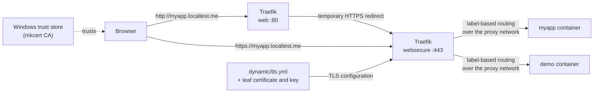
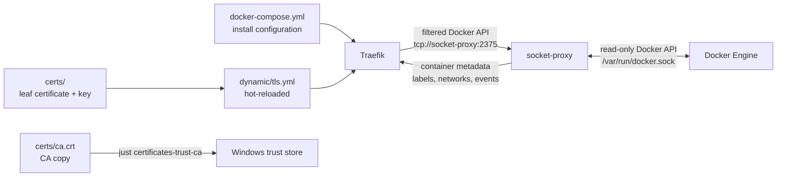

# Architecture

Two views of how this proxy works: how a browser request reaches your
container, and how Traefik discovers containers and loads its configuration.

## Request flow

`*.localtest.me` resolves to `127.0.0.1`, so the browser reaches Traefik in
WSL2 with no `/etc/hosts` edits. HTTP is redirected to HTTPS; the certificate
and key are mounted as exact files and served via `dynamic/tls.yml`. The
certificate is trusted because the mkcert CA is in the Windows trust store.
HTTP-only mode skips the redirect and TLS; any existing certificate files and
Windows trust entry remain present but unused.

## Container discovery and configuration

Traefik watches Docker through the local socket-proxy service for containers that:

1. Are attached to the shared proxy network (default: `proxy`)
2. Have `traefik.enable=true`
3. Have routing labels or a `traefik.hostname` label

It automatically picks them up, no restart required.

## What is localtest.me?

`localtest.me` is a public wildcard DNS domain operated by a third party. Its
commonly used IPv4 wildcard record, `*.localtest.me IN A 127.0.0.1`, resolves
subdomains to the IPv4 loopback address. It is a convenience domain, not an
IETF standard like `localhost`.

This stack publishes Docker ports on IPv4 `127.0.0.1` by default (see
`TRAEFIK_WEB_BIND_ADDRESS`/`TRAEFIK_TCP_BIND_ADDRESS` in
[runtime/configuration.md](runtime/configuration.md)). Some resolvers also
return IPv6 `::1`; if a browser selects IPv6 first and the request fails, use
an IPv4-preferred resolver or configure Docker to publish the ports on IPv6 too.

Why use it instead of `*.localhost`?

- Browsers special-case `localhost` but not all browser + OS combinations treat
  `myapp.localhost` as a secure context or as a valid same-site origin.
- `localtest.me` + a locally-trusted CA makes cookie, CORS, and secure-context
  behavior much closer to production.
- No `/etc/hosts` edits required.

See the DNS-privacy note in [onboarding/certificates.md](onboarding/certificates.md).

## Install and dynamic config

Traefik install configuration lives in each Compose service's `command` list:
[`docker-compose.yml`](../docker-compose.yml) for HTTPS and
[`docker-compose.http.yml`](../docker-compose.http.yml) for HTTP-only mode.
Traefik supports file, CLI, and environment install configuration as separate
methods, so this repository uses CLI consistently rather than mixing methods.
That lets Compose interpolate the selected network, log level, and external
HTTPS redirect port. HTTP-only mode has no `websecure` entrypoint, HTTPS port,
file provider, or certificate mount.

Dynamic TLS configuration lives in [`dynamic/tls.yml`](../dynamic/tls.yml).

The HTTPS Compose file mounts `dynamic/` read-only and mounts only the files
referenced by `TRAEFIK_CERTIFICATE_FILE`/`TRAEFIK_CERTIFICATE_KEY_FILE`
(default `certs/localtest.me.crt`/`certs/localtest.me.key`) at their exact
container paths. Traefik does not receive `certs/ca.crt` or any unrelated
file that may exist in `certs/`. The checked-in `tls.yml` expects those exact
leaf filenames regardless of which host files back them. HTTP-only mode does
not mount or load the dynamic directory or certificate files.

Key install settings in the Compose commands:

- `providers.docker.defaultRule` generates routes from `traefik.hostname`
  labels without explicit `Host()` rules in every label set.
- `docker-compose.yml` sets the Docker provider endpoint and the shared
  network (`proxy` by default, `TRAEFIK_NETWORK_NAME`) with CLI flags. It
  also sets the redirect target to the externally published HTTPS port.
- `providers.file` watches `dynamic/` for hot-reload. HTTPS mode watches the
  whole directory (TLS config plus the backend-TLS-compatibility transport,
  see [runtime/backend-tls.md](runtime/backend-tls.md)); HTTP-only mode loads
  only the single transport file, since it has no TLS config to hot-reload.
- `entrypoints.web` redirects HTTP to HTTPS temporarily in HTTPS mode.
- `api.insecure=false` - the dashboard is exposed only through a labeled
  router: TLS in the default mode and loopback-only HTTP in HTTP mode.

## Security notes

- All ports are bound to `127.0.0.1` only by default - not exposed on the LAN
  unless you deliberately widen `TRAEFIK_WEB_BIND_ADDRESS`/`TRAEFIK_TCP_BIND_ADDRESS`
  (see [runtime/configuration.md](runtime/configuration.md)). Disable or
  protect the dashboard first if you do.
- The dashboard is served over HTTPS through the `proxy.localtest.me` route in
  the default mode. The explicit HTTP fallback serves it over loopback HTTP.
  `api.insecure` remains disabled in both modes.
- Docker socket access effectively grants full Docker API access on the host.
  The raw socket is mounted only into `socket-proxy`; Traefik talks to the
  filtered API endpoint at `tcp://socket-proxy:2375`. Keep this stack
  local-only.
- The leaf private key in `certs/` is mode `600` and gitignored; the CA private
  key is not in the repo at all - mkcert keeps it in its CAROOT. That CA key
  matters: if it leaks and is trusted on any machine, an attacker can mint
  trusted certificates for that CA scope. Treat it as a secret.
- Do not use client, project, or employer names as `localtest.me` subdomains
  on a work network. Use generic names (e.g. `demo`, `api`, `app`).
- Backend HTTPS certificate verification is never bypassed globally. The
  named `skip-backend-certificate-verification` transport (see
  [runtime/backend-tls.md](runtime/backend-tls.md)) is inert until a specific
  service opts in via its own labels.

## WSL2 notes

- Docker Engine runs on the WSL2 instance; `just up` runs there too.
- `*.localtest.me` resolves publicly to `127.0.0.1`, so Windows browsers reach
  WSL2-published ports without `/etc/hosts` changes.
- The optional database port bindings are disabled by default. If an enabled
  port conflicts with a local database, disable that binding again or assign a
  different `TRAEFIK_*_PORT` value in `.env`.
- Certificate trust is determined by the Windows trust store, not the WSL2
  trust store. Use `just certificates-trust-ca` to import `certs/ca.crt` into
  Windows `CurrentUser\Root` (no admin required). To remove it: `just
  certificates-untrust-ca`. If Windows cannot reach WSL2-published ports, that
  is a WSL2 networking or Docker Engine port-publishing issue, not a
  certificate issue.
