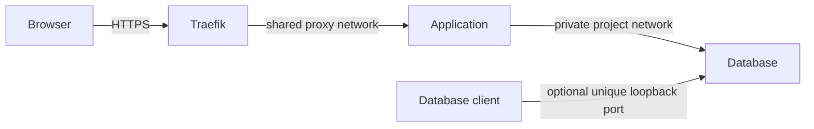

# Connecting services

## Adding a service

In your service's `docker-compose.yml`:

```yaml
services:
  myapp:
    image: myapp:latest
    networks:
      - proxy
    labels:
      traefik.enable: "true"
      traefik.hostname: "myapp"   # routes https://myapp.localtest.me
      traefik.http.routers.myapp.entrypoints: "websecure"
      traefik.http.routers.myapp.tls: "true"
      # Required if no backend port can be inferred or several are exposed.
      # Keeping it explicit also makes examples portable:
      traefik.http.services.myapp.loadbalancer.server.port: "8000"

networks:
  proxy:
    external: true
    name: proxy
```

> **Hostname with the default rule:** if you define an explicit router `rule`,
> `traefik.hostname` is optional and none of the below applies. Otherwise, the
> default rule resolves a service's `*.localtest.me` hostname in this order:
>
> 1. the `traefik.hostname` label, if present (always checked first, used
>    exactly as written)
> 2. the Compose service name, only if `TRAEFIK_FALLBACK_TO_COMPOSE_SERVICE_NAME=true`
>    (normalized - e.g. underscores become hyphens)
> 3. the container name, only if `TRAEFIK_FALLBACK_TO_CONTAINER_NAME=true`
>    (also normalized)
> 4. otherwise, no route is generated for that container at all
>
> Both fallback tiers default to `false` - by default you still need
> `traefik.hostname`, same as the label above. See
> [configuration.md](configuration.md) for both variables.

**Start traefik-local-proxy first** - it creates the `proxy` network. Other
services reference it as external and will fail to start if the network does
not exist. If you run `just down` while no other containers are attached,
start Traefik again before starting those services.

## Connecting another Docker project

In another project's `docker-compose.yml`:

```yaml
services:
  myapp:
    image: myapp:latest
    networks:
      - default
      - proxy
    labels:
      traefik.enable: "true"
      traefik.hostname: "myapp"
      traefik.http.routers.myapp.entrypoints: "websecure"
      traefik.http.routers.myapp.tls: "true"
      traefik.http.services.myapp.loadbalancer.server.port: "3000"

networks:
  proxy:
    external: true
    name: proxy
```

Start `traefik-local-proxy` first, then start the other project. The service
will be reachable at <https://myapp.localtest.me>.

> **Required network name:** The shared Traefik network must be named `proxy`
> by default. Every consuming Compose project must join an external network
> with `name: proxy`. This can be overridden via the advanced
> `TRAEFIK_NETWORK_NAME` setting (see [configuration.md](configuration.md)),
> but only if every already-configured consuming project's own network name
> changes to match - otherwise discovery breaks silently for all of them.

## Project database networking

This proxy is intended to remain running as shared local infrastructure. Both
proxy services use `restart: unless-stopped`, so Docker restarts them after a
Docker Engine or machine restart unless you explicitly stopped them. Start the
proxy once with `just up` (or `just up-http` for HTTP-only), use
`just update` (or `just update-http`) to apply image or configuration
updates, and avoid `just down` during normal use because it also tries to
remove the shared network.

For a project with an application and a database, attach the application to
both its private project network and the shared `proxy` network. Keep the
database only on the private project network:

```yaml
services:
  myapp:
    image: myapp:latest
    networks:
      - default
      - proxy
    labels:
      traefik.enable: "true"
      traefik.hostname: "project-a"
      traefik.http.routers.project-a.entrypoints: "websecure"
      traefik.http.routers.project-a.tls: "true"
      traefik.http.services.project-a.loadbalancer.server.port: "3000"

  postgres:
    image: postgres:17
    environment:
      POSTGRES_PASSWORD: example
    networks:
      - default
    # Optional access for a host client such as DBeaver:
    ports:
      - "127.0.0.1:15432:5432"

networks:
  proxy:
    external: true
    name: proxy
```

The application connects directly to `postgres:5432` using Docker's internal
DNS; it does not send its database traffic through Traefik. A browser reaches
the application through Traefik at <https://project-a.localtest.me>. If
DBeaver, SSMS, or another host application needs database access, publish a
unique loopback port from that project's database container, such as
`127.0.0.1:15432` above. Use a different host port for each project.

The same direct-networking pattern applies to every supported database. If the
Compose service uses the conventional name, the application connects to:

- Postgres: `postgres:5432`
- MSSQL: `mssql:1433`
- MySQL: `mysql:3306`
- Neo4j: `neo4j:7687`



The shared TCP entrypoints described in [database-routing.md](database-routing.md)
are an opt-in alternative for a single database service per entrypoint. Rules
such as ``HostSNI(`*`)`` match all connections and cannot distinguish several
Postgres, MSSQL, MySQL, or Neo4j services on the same port. They are
therefore not the recommended database path when multiple projects use the
same database protocol.
